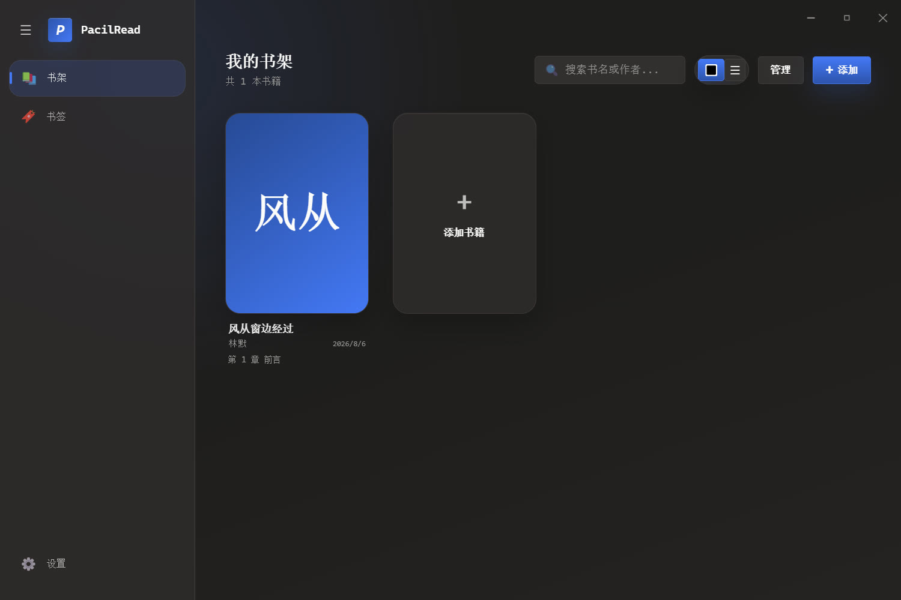
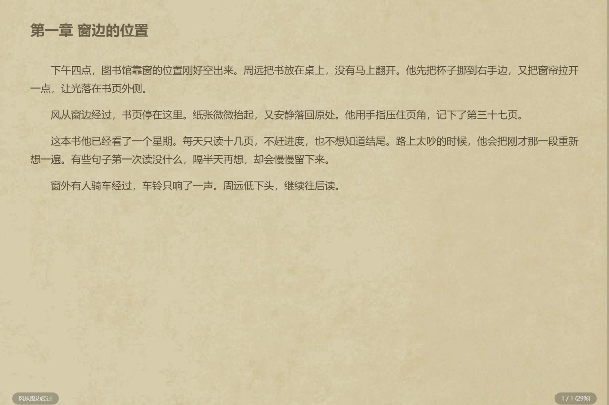
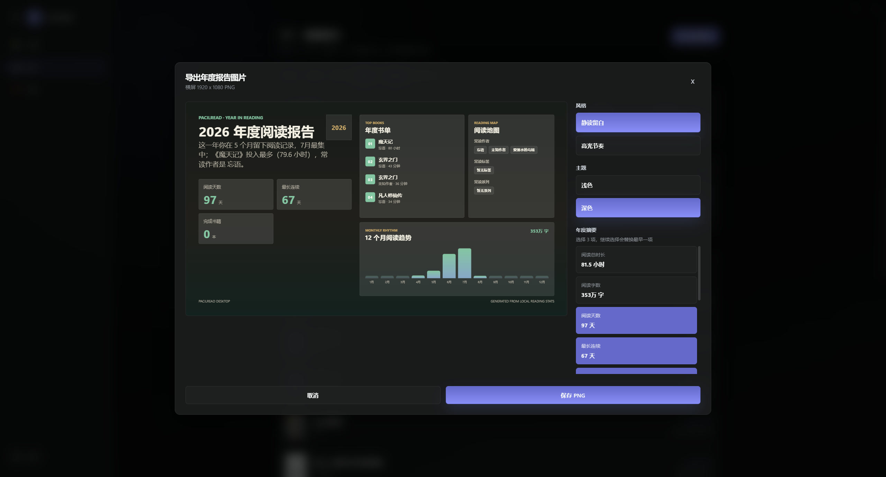

# PacilRead

PacilRead 是我给自己做的一款 Windows 本地电子书阅读器。

起因很简单：我只是想在电脑上安静看会儿书，但不少阅读器不是界面有点旧，就是功能塞得太满，或者干脆带广告、账号和一堆我用不到的东西。于是就自己做了一个，重点放在本地阅读、翻页手感和跨设备续读上。

它不提供书源，也不会推荐内容。书从哪里来、要读什么，都由你自己决定。

## 界面

书架尽量留得简单一些。导入后的书可以按标签、系列和阅读状态整理，平时打开就是接着读。



阅读页内置了纸控、护眼和夜航三套预设。字体、字号、行距、页边距、背景图等也都可以继续细调。

<table>
  <tr>
    <td></td>
    <td></td>
    <td></td>
  </tr>
  <tr>
    <td align="center">纸控</td>
    <td align="center">护眼</td>
    <td align="center">夜航</td>
  </tr>
</table>

## 现在能做什么

- 导入本地 TXT、EPUB 和 PDF，自动整理书名、作者、封面与章节
- 书架支持网格和列表视图，也能按标签、系列和阅读状态筛选、批量管理
- 单页、双页会跟着窗口方向调整，适合桌面、触屏电脑和 Windows 平板
- 支持平移、覆盖、仿真卷页、上下滚动和无动画等翻页方式
- 鼠标、触控、键盘、滚轮都能翻页，也可以设置自动翻页
- 有目录、全文搜索、书签和替换规则，搜索结果能直接跳回正文位置
- 选中文字后可以复制、搜索、替换、朗读，也可以生成引用分享卡
- 支持 Edge TTS 和小米 MiMo 听书，窗口最小化后也能继续播放
- 记录阅读时间，按日、周、月、年查看，还能导出图片报告
- 通过 WebDAV 同步阅读进度，并和 Android 版 PacilRead 共享书签、规则、统计等阅读数据
- 支持 WebDAV 全量和增量备份，书架数据、章节正文、封面与原始书籍文件都能恢复

界面主要按 Windows 11 的样子来做，窗口背景支持云母效果。看书时也可以把窗口置顶，放在屏幕一边慢慢读。

## 图片报告

阅读统计可以按日、周、月、年查看。图片报告会从本地统计里整理阅读时长、字数、连续阅读、常读书籍和月份趋势，导出前还能调整风格、浅深主题和摘要字段。



## 和 Android 版一起用

Android 版在这里：[Metahumanz/PacilReadMobile](https://github.com/Metahumanz/PacilReadMobile)

两端都可以单独使用。配置同一个 WebDAV 目录后，可以在电脑上读到一半，再到手机上接着读。阅读数据会跨端共享，窗口布局、主题细节这类平台设置则各自保存，避免电脑端的习惯覆盖手机端。

PacilRead 也兼容 Legado 的本地 TXT、EPUB 阅读进度格式，但不支持书源，以后也没有接入书源的计划。

## 下载安装

目前桌面版面向 Windows 10 / 11。

1. 打开仓库的 [Releases](https://github.com/Metahumanz/PacilRead/releases)。
2. 下载最新的 `PacilRead-版本号-Setup.exe`。
3. 双击安装即可。

程序数据默认保存在系统应用数据目录，不会改动你导入的原始书籍文件。需要迁移设备时，可以使用 WebDAV 备份恢复，也可以在书架里导出原文件。

## 本地开发

桌面端使用 Vue 3、Vite、Electron 和 TypeScript，本地数据以 JSON 实体文件和压缩章节正文保存。

```powershell
git clone https://github.com/Metahumanz/PacilRead.git
cd PacilRead
npm install
npm run dev
```

常用命令：

```powershell
npm run typecheck
npm test
npm run build
npm run electron:build
```

## 开源与反馈

本项目使用 [GPLv3](LICENSE) 许可证。

遇到问题可以直接提 Issue。功能建议也欢迎，不过我会优先处理自己实际用得到、并且不会让阅读界面越来越复杂的东西。

## 致谢 / 灵感来源

做 PacilRead 时，我参考过下面两个项目的功能和交互：

- [Legado（阅读）](https://github.com/gedoor/legado)
- [ReadAny](https://github.com/codedogQBY/ReadAny)

感谢它们把代码和思路公开出来。
